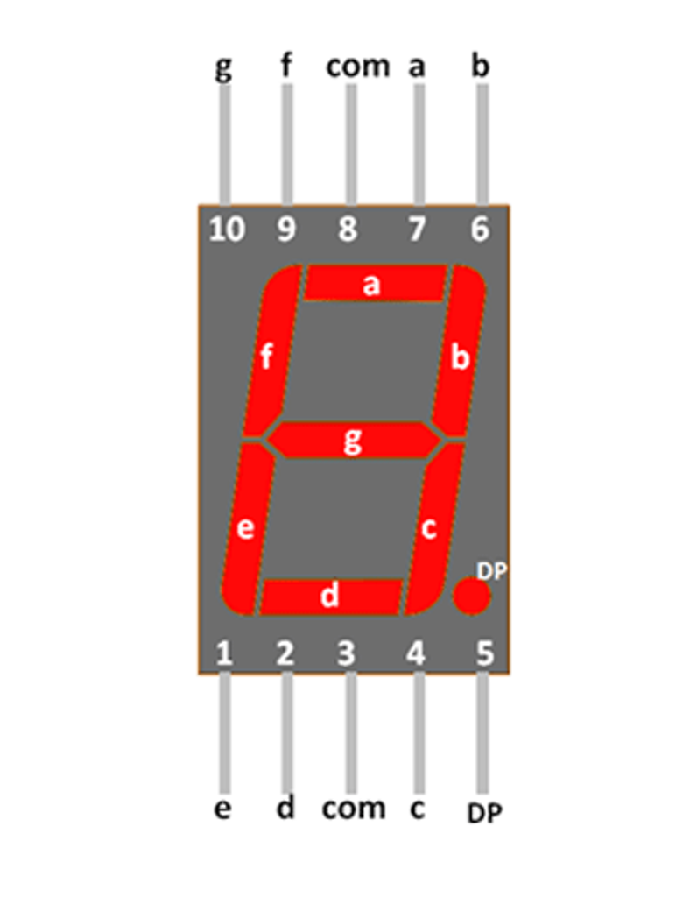
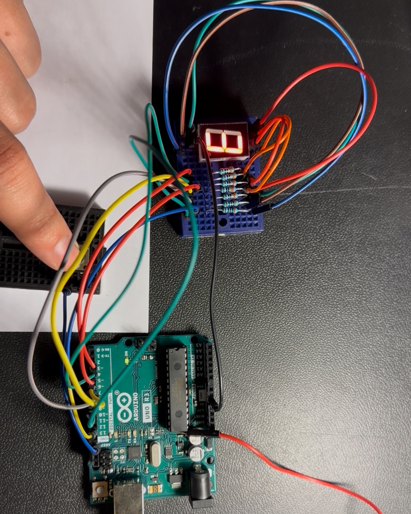

# H01 Seven-Segment Display
## Rykir Evans

### 🛠️ TLDR (AI Enhanced)

This project explored using a **single-digit 7-segment display** with an Arduino, starting from identifying pinouts to writing interactive code that controlled the display.

- 🔌 **Hardware Setup**  
  - Mapped out the 10-pin 7-segment display, identifying which pins control each segment.  
  - Added resistors for each segment (plus the decimal dot).  
  - Assembled and tested the display with manual pin activation.

- 🐍 **Looping Pattern Animation**  
  - Programmed a "snake" animation where segments light up in a rotating pattern.  
  - Used digital pins and `digitalWrite()` with delays to create smooth visual flow.  
  - Learned how to manage pin mapping, timing, and animation logic.

- 🔢 **Button-Controlled Number Incrementer**  
  - Used a tactile button to increment through digits 0–9 on the display.  
  - Implemented two arrays: one for segment pins, and one for digit configurations.  
  - Included debounce logic to ensure clean single-step inputs.  
  - Demonstrated how to combine input reading with dynamic output control.

- 🎲 **(Pseudo) Random Number Generator**  
  - Removed debounce logic to let digits cycle rapidly while the button is pressed.  
  - Created a “randomized” number effect based on when the user releases the button.  
  - Showed how reaction timing can simulate randomness without needing random functions.

> This is a condensed summary. Full project details, code explanations, and reflections can be found in the **Full Description** section below.


### Full Description:

Moving on from simple LEDs, one of my personal projects that I was able to take home and work on over the first weekend of this course was a single seven segment display. Having worked extensively with the idea of seven segment displays in a previous Logic Design course, I was captivated by turning that work into a physical circuit. This homework project goes from learning how to power the display to creating a pattern, and ultimately a number incrementer.

#### Understanding
First, I needed to see which pins the seven-segment display used for which segment. I was initially a little confused by the display having 10 pins, but with some reasoning, I deduced that there were 7 for each segment, another for the dot in the bottom right-hand corner, and two options for a ground path. The wiring schematic was a little confusing and atypical compared to what I have worked with in the past, but below is a diagram I used to understand it.

|                                Seven-Segment Display Pin Map                                   |
| :------------------------------------------------------------------------: |
|     |

Now knowing which pins lit up which segment, I assembled the circuit pictured below. It was a little resource intensive for one display since each segment required a resistor, but in the end, it looked neat.

|                   Bird's Eye                  |                     Close-up                 |
| :-------------------------------------------: | :------------------------------------------: |
|   |  |

#### Looping Experiment
Understanding the pin correspondance allowed me to take the next step and start coding something. Since the Arduino code majorly utilizes a loop function by default, the first thing I thought of was a looping pattern. I compiled the code below to loop in a snake-like pattern.

*Please note the seemingly random pin declaration at the top is a result of my wiring scheme being slightly different from the above diagram. The code should still produce a snake pattern if replicated.

```ino
const int A = 3;      // Arduino Pins
const int B = 2;
const int C = 8;
const int D = 7;
const int E = 6;
const int F = 4;
const int G = 5;

const int pattern[] = {A, B, G, E, D, C, G, F};

void setup() 
{
  for (int i = 0; i < 7; i++) {
    pinMode(pattern[i], OUTPUT);  // Set each pin as output
  }
}

void loop() 
{
  for (int i = 0; i < 7; i++)
  {
    digitalWrite(pattern[i], HIGH);
    delay(100);
    digitalWrite(pattern[i], LOW);
  }
}
```

|       Video Link      |
| :-------------------: |
| [Snake Loop](./media/display-snake-loop.MOV) |
| This video showcases the looping effect programmed using the above code |

#### Incrementer Experiment
With time in the weekend quickly running out, I was only able to complete one more experiment with my setup. I attached a button onto another mini breadboard and modified the code extensively to allow the display to keep track of a single digit number. The bulk of the code comes from the array declarations that allow it to work easily with the loop. There is also some protection against holding the button down since the delay is so minimal that it would effectively become a random number generator (explained further in next section).

|                   Bird's Eye                  |                     Close-up                 |
| :-------------------------------------------: | :------------------------------------------: |
|   |  |

The code utilizes a 2D array, storing the segments that light up certain numbers. I was unsure if there was a more efficient way to go about this, perhaps with a pre-existing library, but for this experiment, these segment patterns had to be hard-coded. Despite the fact that a 7-segment display is capable of storing 16 distinguishable numbers (using hexadecimal), I stopped short of that, and only coded the decimal range. With the addition of some variables and logic, the code from there was straight forward. The entire snippet is below:

```ino
const int A = 3;      // Arduino Pins
const int B = 2;
const int C = 8;
const int D = 7;
const int E = 6;
const int F = 4;
const int G = 5;

const int segments[] = {A, B, C, D, E, F, G};

const int numZero[]  = {A, B, C, D, E, F};       // 0
const int numOne[]   = {B, C};                   // 1
const int numTwo[]   = {A, B, G, E, D};          // 2
const int numThree[] = {A, B, G, C, D};          // 3
const int numFour[]  = {B, C, G, F};             // 4
const int numFive[]  = {A, F, G, C, D};          // 5
const int numSix[]   = {A, F, G, C, D, E};       // 6
const int numSeven[] = {A, B, C};                // 7
const int numEight[] = {A, B, C, D, E, F, G};    // 8
const int numNine[]  = {A, B, C, D, F, G};       // 9

const int *nums[] = {numZero, numOne, numTwo, numThree, numFour, numFive, numSix, numSeven, numEight, numNine};
const int numSegmentCounts[] = {6, 2, 5, 5, 4, 5, 6, 3, 7, 6};  // how many segments per digit


const int numPins = 7;
const int buttonPin = 12;

int buttonCnt = 0;
int buttonState = 0;

// Display function that iterates through desired segments to light them up
void display(int number, int *segmentCode[])
{
  int *temp = segmentCode[number];
  int count = numSegmentCounts[number];
  for(int i = 0; i < count; i++)
  {
    digitalWrite(temp[i], HIGH);
  }
}

void setup() 
{
  for (int i = 0; i < numPins; i++) 
  {
    pinMode(segments[i], OUTPUT);  // Set each pin as output
  }

  pinMode(buttonPin, INPUT_PULLUP);
  Serial.begin(9600);
}

void loop() 
{
  // Read button
  buttonState = digitalRead(buttonPin);
  
  display(buttonCnt % 10, nums);
  
  // Wipe old number from display and increment once button is pressed
  if(buttonState == LOW)
  {
    for (int i = 0; i < numPins; i++) 
    {
      digitalWrite(segments[i], LOW);
    }

    buttonCnt++;

    display(buttonCnt % 10, nums);

    Serial.println(buttonCnt);
    delay(1);

    // Prevents number from increasing while button is held down
    while(buttonState == LOW)
    {
      buttonState = digitalRead(buttonPin);
      delay(50);
    }
  }
}
```

#### Bonus: (Virtually) Random Number Generator
In coding the above snippet, I found the `while` loop at the very end to be crucial to the circuit actually functioning like an incrementer. Removing this loop allows the main `loop()` function to run without delay, causing the numbers to increment extremely quickly. To the naked eye, this makes the numbers on the display indistinguishable and thus, once letting go of the button, the number on the display appears to have been randomly selected. Despite the logic being perfectly deterministic, human reaction time creates the illusion that this number is random, and thus, as a bonus, I created a virtually random number generator.

Unfortunately, I did not film this in action, and had to tear down the circuit during class the next day, but if you're willing to recreate the circuit, it's as simple as commenting out the `while` loop condition, but you MUST leave the `buttongState = digitalRead(buttonPin);` line. The `delay(50);` is optional, but will only be a minimal difference.