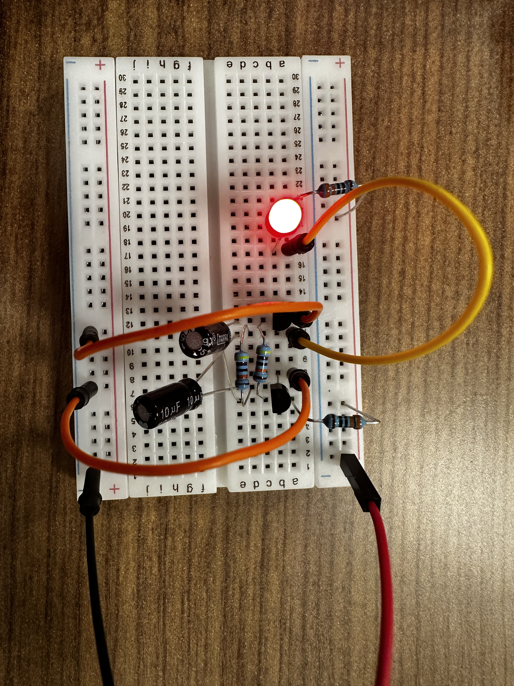

# H02 Arduino-Less Electric Circuits
## Rykir Evans

### 🛠️ TLDR (AI Enhanced)

> Refer to [AI Disclaimer](./../README.md) for more information

This project explores building **oscillating LED circuits without any microcontroller**, relying solely on **passive and active electronic components** like **transistors, capacitors, and resistors**. It began with a **single LED blinking circuit** and evolved into a more complex attempt at a **multi-LED sequential flasher**—with mixed results.

- ⚡ **Concept**:  
  Oscillating circuits built entirely **without Arduino**, powered by feedback loops between **transistors and capacitors**

- 🔧 **Hardware**:
  - 2x NPN Transistors (e.g. 2N2222 or similar)
  - 2x Capacitors (tuned via trial & error)
  - 4x Resistors
  - 1x LED (initial), 4x LEDs (strobe version)
  - Pushbutton (added for safety)
  - Basic Breadboard setup with jumper wires

- 💡 **Circuit #1 – Single LED Blinker**:
  - Capacitors alternate discharging, toggling transistor states
  - Only one LED blinks, but blink **rate fluctuates**
  - Most stable behavior achieved with **0.1μF + 100μF** capacitor combo
  - Resistors between transistors ~5Ω (approx.)

  🎥 [Watch Blinker Demo](./media/intro-video.MOV)

- 💥 **Circuit #2 – Strobe Light**:
  - Based on schematic from peer
  - Intended to blink **4 LEDs in sequence**
  - Actual behavior: **all LEDs flash simultaneously** at high speed
  - Resembles a **strobe light**, very bright, rapid blink
  - Pushbutton added to prevent accidental flashing

  🎥 [Watch Strobe Demo](./media/strobe-video.MOV)

- 🧠 **Lessons Learned**:
  - Discovered how small component changes affect circuit behavior  
  - First practical exposure to **transistors as switches**  
  - Gained knowledge useful for later projects like the [Custom Keypad](./../P01A/) daughter-board fix  
  - Blink instability & unintended behavior likely due to timing misbalance or component variance

- 📷 **Media**:  
  | Single LED Blinker | 4-LED Strobe Circuit |
  | :----------------: | :------------------: |
  |  |  |

> For further schematics and refinements, revisit this README later in the semester (to be updated).

### Full Description
Early on in the course, once we received our materials, we started experimenting with the more advanced of the basic breadboard components, i.e. transistors, capacitors, etc. This led us to initially be able to blink an LED, similar to that of how [L01](./../L01/) started.

This would ultimately be one of the harder things I would do throughout this course. No matter what I tried or what schematics I was able to source from the internet, I would only manage to get the single LED blinking, and it even felt like it was not working as intended.

#### Intro
The circuit was rather simple, making use of two capacitors, two NPN transistors, four resistors, and a few jumpers to light a single LED. The bird's eye view is pictured below.

|                   Bird's Eye                  |   
| :-------------------------------------------: | 
|   | 

According to ChatGPT, slight variations in the structure of the transistors causes one of them to activate first, leaving the other to activate after it's pertinent capacitor had finished discharging. Emphasizing the aforementioned struggle, I really had to play around with this beginner circuit to even be able to get the LED to blink. I found the most success in varying the capacitance of the capacitors. Initially a 10μF and a 100μF were recommended, however, I saw the most success with a 0.1μF and a 100μF capacitor. The resistors were only approximately 5Ω between the transistors, and once I had finally figured out through sheer trial-and-error, I managed to get the LED blinking.

However, I mentioned it still felt a little off. This was because the blinks were not constant, and instead you could obviously tell the rate between blinks was fluctuating. I did not have enough knowledge to be able to discern why.

[Click here for the video of the blinking LED](./media/intro-video.MOV)

#### Custom Circuit

Using the below schematic a fellow classmate happened upon, I was able to assemble another circuit, however, this one definitely did not behave as intended.

The circuit was meant to light 4 LEDs in a discernable sequence. My initial assembly caused all of them to light up. Again, through sheer trial and error of varying capacitors, resistors, and even some transistors, I managed to get something that at least blinks. There is no discernable sequence, and in fact, the blink is so fast and bright, it mimics a stroble light.

|                   Bird's Eye                  |   
| :-------------------------------------------: | 
|   | 

I added a button so this could be controlled, and not unexpectedly blind you during it.

[Click here for the video of the strobe light](./media/strobe-video.MOV)

Unfortunately, I was never able to achieve the intended effect before I had to move on. However, the knowledge was still extremely valuable for later projects, specifically learning how transistors work, which came in handy when I engineered a daughter board fix for [my custom keypad project](./../P01A/).

#### Conclusion
While many difficulties were faced throughout learning how to use these electrical components, I still learned valuable information that helped me in later projects. **Note:** Sorry for the lack of details in this README, I am trying to simply get something uploaded, and I will hopefully have a more finalized version before the end of the day, definitely throughout next week.