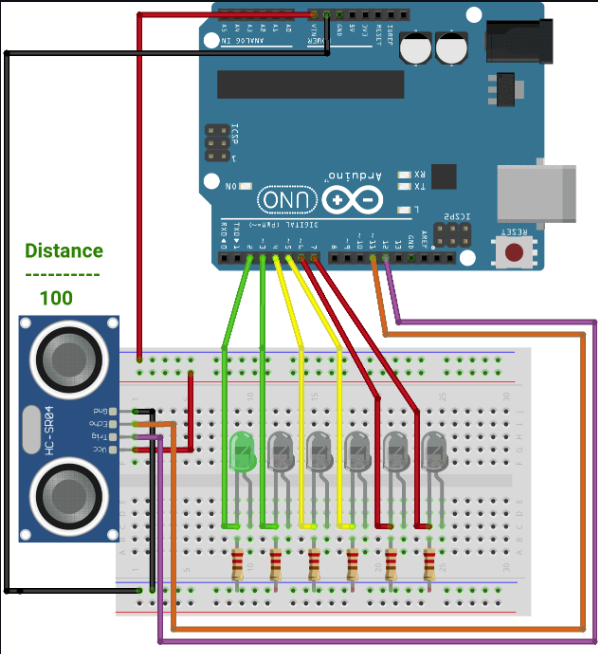
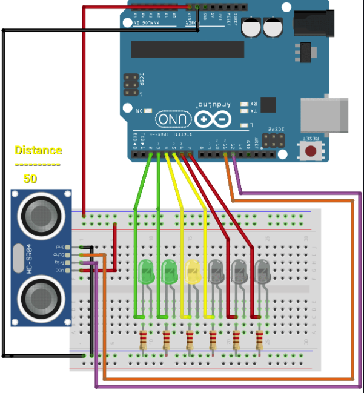
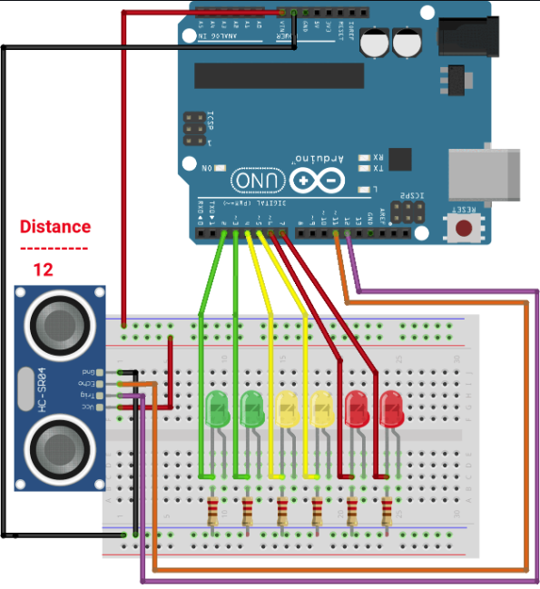

# L03 Distance Indicator & Soldering
## Rykir Evans

### 🛠️ TLDR (AI Enhanced)

> Refer to [AI Disclaimer](./../README.md) for more information

This project is a **proximity-based LED display** that uses an **ultrasonic distance sensor** to detect how close an object is, lighting up **green**, **yellow**, or **red LEDs** accordingly. The system was first prototyped on a breadboard and then **soldered onto a PCB** for durability and permanence.

- 📏 **Functionality**:  
  Distance → Color Indicator  
  - **Green LEDs** = Far  
  - **Yellow LEDs** = Mid-range  
  - **Red LEDs** = Close  
  (Ranges hardcoded manually using if/else statements)

- 🔧 **Hardware**:
  - Ultrasonic Sensor
  - 6 LEDs (2 per color)
  - PCB with through-hole components (Breadboard-Style)
  - Jumper wires color-coded by function
  - Arduino-compatible microcontroller

- 🧠 **Code**:
  - Uses a starter script to read distance
  - `lightLED()` function maps distance to a `stopLED` index  
  - LEDs light in sequence to visualize proximity in real time  
  - Adjusted `delay()` to 50ms for smoother transitions

- 🔩 **Soldering Highlights**:
  - First-time experience with through-hole soldering  
  - Careful planning for neat layout (flat jumpers, color-coded)  
  - Used flux and proper heat timing ("iron in first, out last")  
  - Minor errors: melted LEDs, dim lighting from mismatched resistors

- 📷 **Media**:  
  | Circuit in Action | Final Product | Underside Views |  
  | :---------------: | :-----------: | :--------------: |  
  |  |  |  |

🎥 [Watch Demo Video](./media/product-demo.MOV)

> For full schematics, code, and detailed soldering notes, see below in **Full Description**.

### Full Description:

This lab would be a simple project in the form of a distance ranging device that indicates how close/far something is via colored LEDs. The distance readings would be coming from a ultrasonic distance sensor, a very common module. The major part of this project would be soldering the design we make onto a printed circuit board (PCB).

Below, the circuit schematic indicates that the circuit will light only the green LEDs when something is relatively far away, yellow indicates the object is a relatively medium range, and red indicates the object is extremely close. There were no definite ranges to be used in the lab, and that was left to be determined by us. 

|                    Far Away                     |                     Mid-Range                  |  Close-Range          |
| :---------------------------------------------: | :--------------------------------------------: | :-------------------: |
|   |  | 

The wiring was ultimately fairly simple, adhering to the schematic yielded a smooth transition from concept to reality, and for the lab, we were also provided with the starter code to get the Ultrasonic Distance Sensor working, and our job was to program the ranges that would light up the LEDs.

The starter code for the sensor is below:
```ino
// Ultrasonic Distance Measurement with HC-SR04
// Author: Your Friendly AI (ChatGPT) & Rykir Evans
// Platform: Arduino (Uno/Nano/Etc.)

const int trigPin = 11;   // TRIG pin of HC-SR04
const int echoPin = 12;  // ECHO pin of HC-SR04

void setup() {
  Serial.begin(9600);          // Start serial communication
  pinMode(trigPin, OUTPUT);    // TRIG is an output
  pinMode(echoPin, INPUT);     // ECHO is an input
}

void loop() {
  long duration;
  float distance_cm;

  // Clear the TRIG pin
  digitalWrite(trigPin, LOW);
  delayMicroseconds(2);

  // Send a 10 microsecond pulse to TRIG
  digitalWrite(trigPin, HIGH);
  delayMicroseconds(10);
  digitalWrite(trigPin, LOW);

  // Read the echo pulse duration (microseconds)
  duration = pulseIn(echoPin, HIGH);

  // Calculate the distance (cm)
  // Speed of sound = 343 m/s = 0.0343 cm/us
  distance_cm = (duration * 0.0343) / 2;

  // Print to Serial Monitor
  Serial.print("Distance: ");
  Serial.print(distance_cm);
  Serial.println(" cm");

  delay(500);  // Wait half a second before next measurement
```

There were any number of ways to insert our code such that it lit up the LEDs based on distance. The guiding step in the lab suggested we divide a definite maximum range by 6 since there were 6 LEDs. I favored the approach of hardcoding ranges which is less than ideal for scalability, but it helped me with the understanding.

The ranges I used are found in the table below:

> The LED arrangement is from left to right, i.e. `Green1` is the leftmost, `Green2` is the rightmost

|  Distance  |   Max LED Lit   | 
| :--------: | :-------------: |
|   >=35cm   |      Green1     |
| 25cm-35cm  |      Green2     |
| 20cm-25cm  |     Yellow1     |
| 15cm-20cm  |     Yellow2     |
| 10cm-15cm  |       Red1      |
|   <=10cm   |       Red2      |


The code I inserted was a simple if/else chain regarding distances, setting a variable for a maximum LED to be lit to achieve a "build-up & build-down" effect. I would turn all of the LEDs off, and use a for loop to light all LEDs up to the `stopLED`. The code was fairly simple, and I was able to abstract it into a function named `lightLED()` which has the distance variable passed into it. I call the function at the end of the starter code, just before the delay. The function and relative call are shown below:

```ino
void lightLED(int dist)
{
  int stopLED = -1;
  if (dist < 10) {          // Light all
    stopLED = 7;
} else if (dist < 15) {   // Light up to red1
    stopLED = 6;
} else if (dist < 20) {   // Light up to yel2
    stopLED = 5;
} else if (dist < 25) {   // Light up to yel1
    stopLED = 4;
} else if (dist < 35) {   // Light up to grn2
    stopLED = 3;
} else {                  // dist >= 35, Light grn1
    stopLED = 2;
}

  // Turn all LEDs off
  for(int i = 3; i < 8; i++)
  {
    digitalWrite(i, LOW);
  }


  // Light LEDs up to maximum LED
  for(int i = 3; i <= stopLED; i++)
  {
    digitalWrite(i, HIGH);
  }

  return;
}
```

<br>

```ino
// ...
 Serial.println(" cm");

  lightLED(distance_cm); // Function call

  delay(50);  // Wait before next measurement
} // End loop
```
> I additionally changed the `delay()` to 50 milliseconds to achieve a smoother transition

### Soldering
With the circuit functioning as intended, our next objective in this lab would be soldering the circuit onto a PCB that has internal connections similar to a breadboard. With many of us having minimal to no soldering experience, this would be the largest learning experience of this lab, and many of us would practice with basic connections to get the understanding necessary to make an actual soldered circuit that looks decent.

#### Preparation

Once I had enough practice under my belt, I sat down for several hours to prepare the circuit. I am a large fan of neatness, so I spent a relatively large amount of time just planning and curating the design of the circuit. I opted to use jumpers the lay flat along the PCB and dive into their connection at a 90 degree angle. I also tried my best for color-coding these wires, in which the scheme is found below:

* Red: 5V+ and red LEDs
* Gray: Ground connection
* Yellow: yellow LEDs
* Orange: green LEDs
> I had to use orange jumpers due to a shortage of green jumpers unfortunately

For the components that had long flexible leads such as resistors and LEDs, I was able to stick them in their slots onto the PCB and bend the leads to keep them from falling out. For the connectors and the Ultrasonic Distance Sensor, the leads were not long enough to accomplish this and I would have to figure something else out. Below is a picture of the circuit with all components that could hold themselves in.

|              Top View               |               Bottom View           | 
| :---------------------------------: | :---------------------------------: |
| |  |

#### Solder Process
Once I was able to turn the board over, I could begin soldering. Following typically guidelines, I made sure to use flux on the joints I would be soldering, and I cut the leads following completion of the joint. This was not without error which will be discussed in the next section, but once I was able to solder in the prepared components, I could also solder the connectors and the Ultrasonic Distance Sensor. These were tricky, thankfully I had a Helping-Hands setup that allowed me to hold everything in place. The completed solder board is below.

|              Bird's Eye View            |               Close-Up View          | 
| :---------------------------------: | :---------------------------------: |
| |  |

I followed the advice of having the iron be first in and last out, and trying to achieve consistent wetting of the solder, which worked out well considering this is still one of my first few times soldering.

My self-assessment of my soldering job showed me that I still had a long way to go. The solder mounds themselves seemed okay, but the leads being bent gave it a sloppy appearence. Below is a picture of the underside.

| Side View of Bottom | Bird's Eye View of Bottom |
| :-----------------: | :-----------------------: |
|  | 
| The mounds are relatively consistent in size and shape with minor deviations, but needs more work on achieving straight leads.| Solder is also found on unintended joints. 

#### Final Product
From here, it was as simple as connecting to the connector pins on the PCB and Arduino, and running the code. In the future, these connections will hopefully be made into a single wire so individual jumpers done have to look so messy. 

Below is a video link to the final soldered circuit in action:

|                Thumbnail & Video               |
| :--------------------------------------------: |
|   |
| [Video Link](./media/product-demo.MOV)         |


#### Errors (Major Learning Opportunities)

**#1: LED Melting**

During my soldering, I unfortunately melted two LEDs, one of which is shown below. This was due to inadequate desoldering attempts to properly remove solder from the joints, leaving some solder behind. Against my better judgement, I attempted to adhere the LEDs to the PCB via simply melting this solder and pushing the LEDs through. Unbeknowst to me, this caused the cathode of the LED to heat up enough to melt the plastic case, pushing the cathode through and destroying the LED.

| Melted LED  |
| :---------: |
||

**#2: Dim LEDs (Unsure why)**
In my original circuit, due to a shortage of resistors at the time of assembly on the breadboard, half of the resistors I used were slightly too high for the 3.3V LEDs I was making use of an even mix of 110Ω and 300Ω resistors since it was what I had on hand, one for each color of LED. Ideally, the 110Ω resistor would have been fine considering the 5V power supply, and the 300Ω resistor would have been overkill.

Interestingly enough, this effect is hardly noticeable on the green LEDs, both operate at a visible brightness. The yellow LEDs are the hardest to see, followed closely by red. Another interesting even was that I attempted to use a friend's computer for a power supply, and even though it should have been the same, his computer lit the LEDs brighter. This was extremely interesting to witness, but we could not pinpoint the issue, because uploading different code also had the same effect. 

This can all be seen in the [video](./media/product-demo) showing the functioning of the soldered circuit.

### Conclusion
Overall, this lab was extremely interesting, but required hours of diligent work, in preparation, understanding, and doing. I learned valuable skills in soldering as well as using my first advanced module.