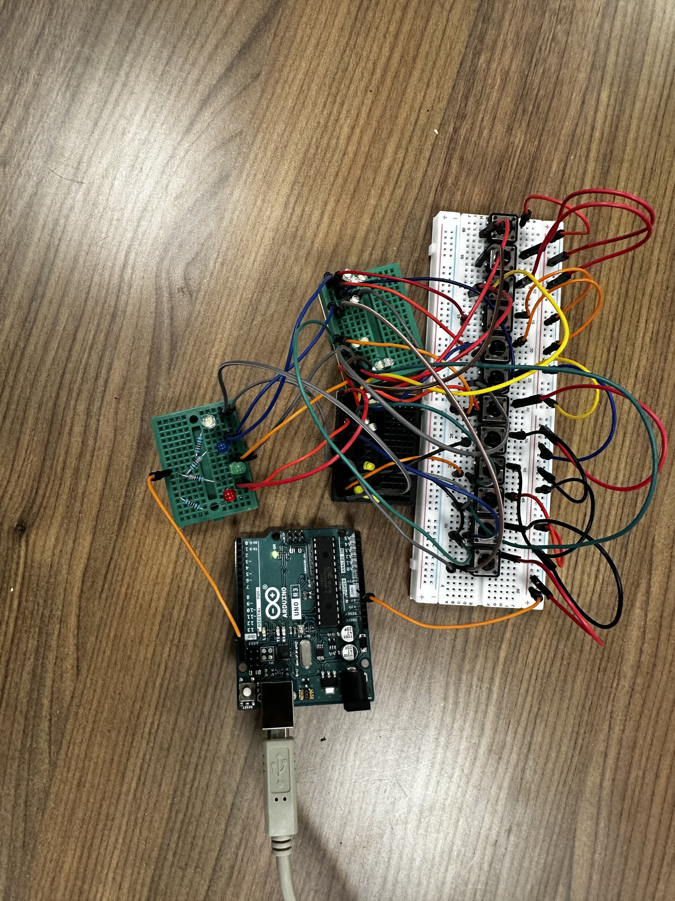
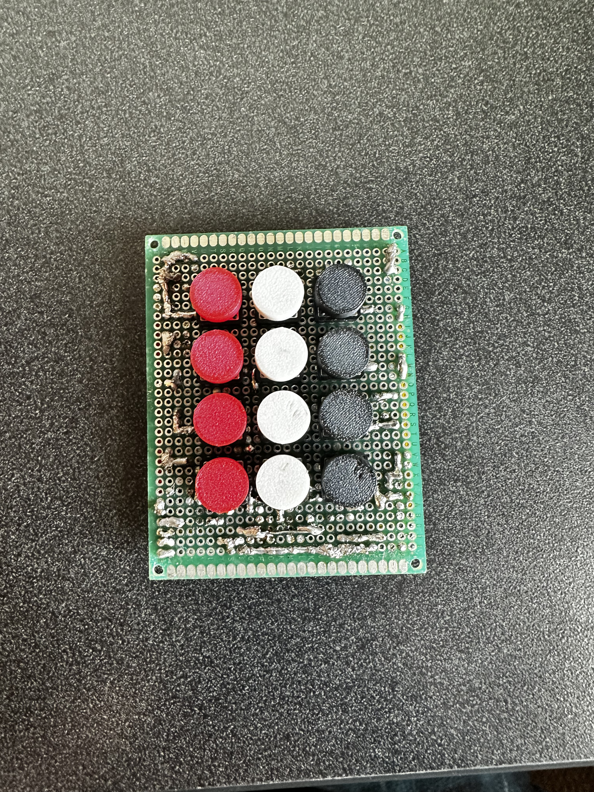
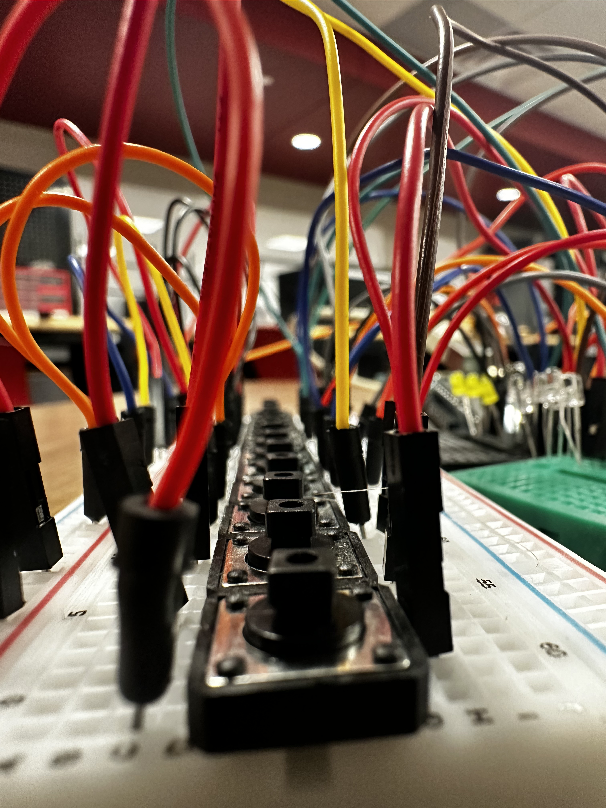
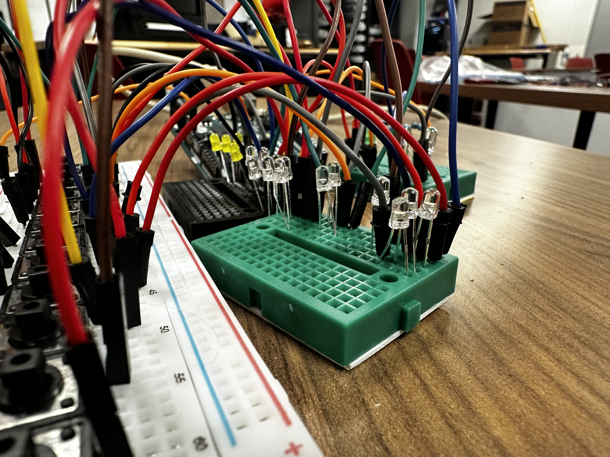
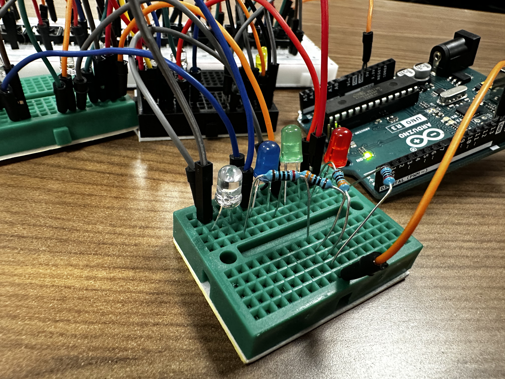
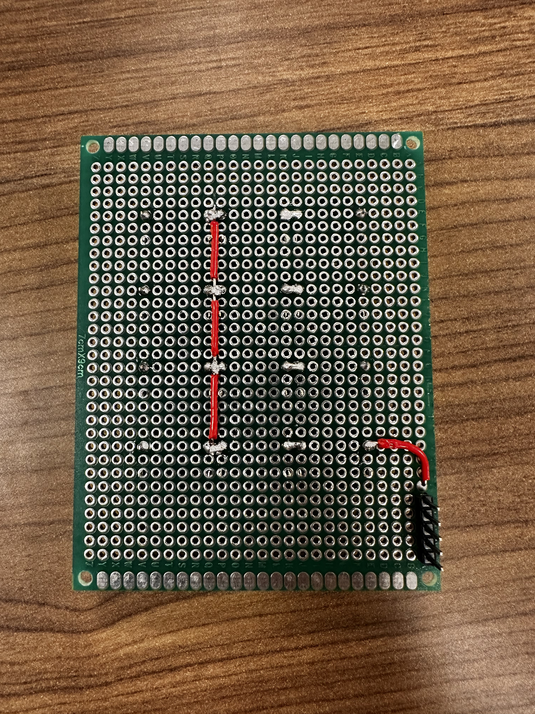
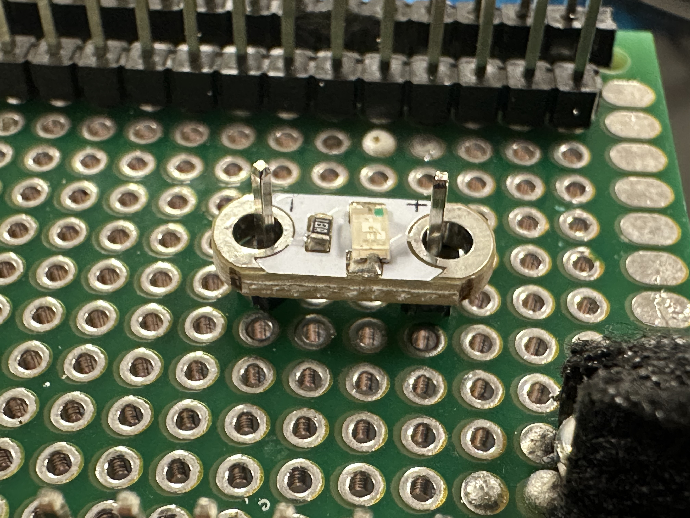
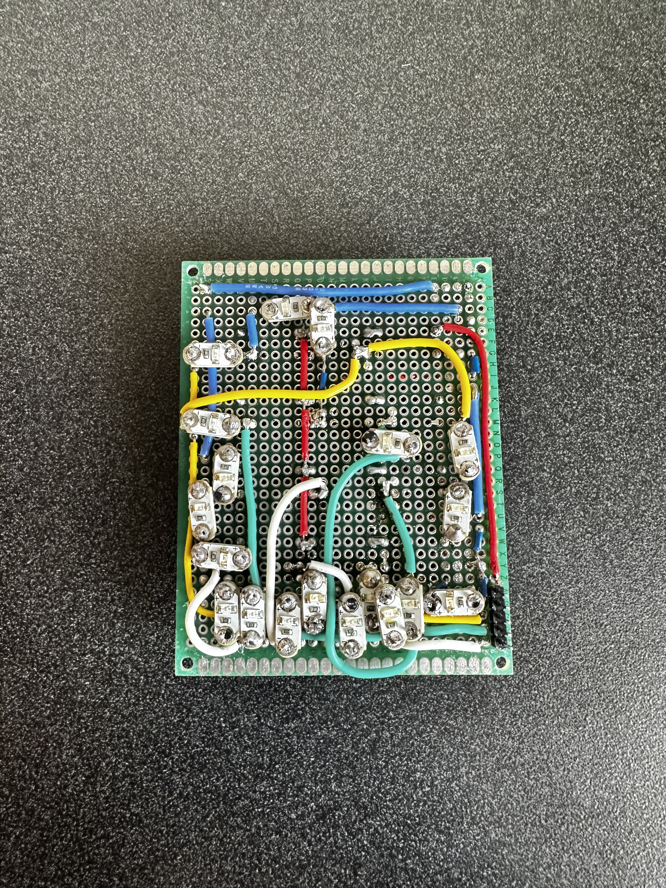

# P01A (Part A) Custom Keypad
## Rykir Evans
# P01A (Part A) Custom Keypad  
## Rykir Evans

### 🛠️ TLDR (AI Enhanced)

> Refer to [AI Disclaimer](./../README.md) for more information

This project explores creating a **fully custom binary-encoded keypad** designed to operate with only **5 Arduino pins** instead of the typical 13+ used by a 3x4 matrix. Inspired by a hardware shortage, the project involves **engineering a unique keypad** where each number is encoded into a **4-bit binary signal** and read digitally.

- 🔢 **Keypad Design**:  
  - 12 pushbuttons mapped to 4-bit binary combinations  
  - Button `0` mapped to `1010` to distinguish from no input (`0000`)  
  - **Little-endian layout**: bit 1 → pin 12, bit 8 → pin 9

- ⚡ **Binary Encoder Logic**:  
  - Uses Arduino `digitalRead()` to convert active LOW signals to decimal  
  - LEDs used as **diodes** to prevent voltage backflow  
  - Button press = one unique binary value → converted to number

- 🔧 **Hardware**:
  - 12 pushbuttons
  - Micro LEDs acting as diodes
  - Standard perfboard (7cm x 9cm)
  - Header pins & jumpers (color-coded)
  - Custom-built **daughter-board** with transistors for logic correction

- 🧠 **Code**:
  - Reads each bit with inverted logic (`!digitalRead()`)
  - Adds up binary values to form decimal
  - Special handling:
    - Value `10` = button 0  
    - Value `0` = no button → set to `-1`
  - Includes 500ms read delay and debug `Serial.println()` outputs

- 🔩 **Soldering Highlights**:
  - Longest soldering project to date (~2 weeks)
  - Wire routing was difficult due to tight PCB layout and bulky wire
  - Micro LEDs required creative mounting with header pins
  - Debugged multiple issues:
    - Shorted traces from shared inputs
    - Capacitance buildup causing false readings
    - LED diodes behaving differently than expected

- 🧪 **Daughter-Board Fix**:
  - Prototype board added **pull-down resistors and transistors**
  - Reads **active LOW** values by detecting current flow to ground
  - In-progress: missing 8-bit and 4-bit connections

- 📷 **Media**:
  | Prototype Top | Soldering Prep | Final Keypad | Daughter-Board |
  | :-----------: | :------------: | :----------: | :------------: |
  |  |  |  |  |

🎥 [Watch Prototype Video](./media/encoder-vid.MOV)

> For soldering diagrams, debugging notes, and test code, see **Full Description** below.


### Full Description:
This project was discussed from very early on in the semester. We had to choose something to build by the end of the term before we even had all of our parts. I tried brainstorming on my own, but at the time, I had barely learned how to light an LED, so I used ChatGPT for some brainstorming help. An idea it listed was a safe-cracking game, and that caught my attention, but I kept thinking about it, and came up with the idea to make a number guessing game with `Wordle` mechanics. The project itself will be discussed more in [Part B](./../P01B/README.md). 

Due to a shortage of materials, I did not have access to the keypad that would be vital to making this game. Dr. Griffin inspired me by asking "Why don't you make your own keypad?" This sounded like a great idea in my head, but the more I planned it out, the more difficult it would seem. First, my initial idea was a 3x4 keypad to encapsulate all of the numbers and two functional buttons. Plus a power input, this idea needed 13 pins. That would have taken all of the available pins from the Arduino just for the keypad of the game.

I was stuck with this idea for a little while, but just before going to bed one night, I had a bright idea to encode the numbers into a binary electrical signal. After some mental planning, I realized this would shrink it down from 13 to only 5 pins. This sounded great, but I would have a few things I needed to work out.

For a slightly more detailed explanation of "using binary", the buttons would be linked to only 4 pins instead of their own individual pin. Representing numbers as themselves in binary, 

> i.e. `0001` = `1`, `1011` = 11, etc. I would be 

Labeling the pins in **little-endian** fashion. In this layout, similar to how actual computers use binary, a `1` would indicate power, and a `0` would indicate no power. Each number would be wired up to their respective binary pins accordingly.

#### Prototyping
I was so happy that I came up with a seemingly smart idea that I was ready to jump right into soldering. Thankfully, Dr. Griffin recommended some prototyping first, and I would proceed to do so. Using a breadboard for it's intended purpose of prototyping, I placed 12 buttons in a row, and quickly discovered that the `0` button would be a problem. Since in binary, 0's four bit representation is `0000`, I would have to find a way to distinguish it from no button being pressed at all. This was pretty simple since I was only using 12 of the 15 other possible combinations of 4 bits. I simply made 0 represented by 10 in binary (`1010`).

During construction of this prototype, I recalled that this idea is fairly standard in similar use cases, and even has it's own name. It's often referred to as a `binary encoder`. The first test didn't work as expected. I used LEDs to represent the 4 bits, and no matter what button I pressed, all of the LEDs would light up. Through some testing with a multimeter, I quickly found out that electricity doesn't just take the shortest path to ground, it will spread out in all directions if it can. 

To circumvent this, I was conversing with Dr. Griffin and he mentioned diodes, but we did not have any in the lab equipment. However, LEDs are diodes by design, and it's even in their name (Light Emitting Diode). After I realized this, I used some small 3V LEDs to act as diodes, and in the final prototype, they were indeed lighting up correctly.

[Click here for the video of the working prototype](./media/encoder-vid.MOV)

 Below are a few pictures of the final prototype.

 |                   Bird's Eye                           |                     Close-up 1                      |
 | :----------------------------------------------------: | :-------------------------------------------------: |
 |   |  |

 |                   Close-up 2                          |                        Close-up 3                   |
 | :---------------------------------------------------: | :-------------------------------------------------: |
 |    |  |

 > Please note the LEDs representing the 4 bits in `Close-up 3` are in little-endian layout (white represents 8, red represents 1) This is **NOT** exactly the same as the final keypad colors.

 #### Soldering
 Once I had a working prototype, I quickly got ready to solder, and found out how monumental this task would be. My first soldering attempt was laying out the buttons spaced evenly and how I wanted them. I then soldered their north-most pins and cut a **red** wire at spaced intervals to lay in-between these to-be soldered joints (pictured below along with the top view). **Red** would be used to represent voltage input.

 |                   Keypad Top                           |                     Keypad Bottom                       |
 | :----------------------------------------------------: | :-----------------------------------------------------: |
 |    |  |

 Another issue I ran into when soldering was discovering exactly how I would make use of LEDs as diodes. For me, the normal 3V LEDs were just too bulky to use, so I opted to use some of the micro-LEDs we had on hand. These did not come with pins built in, they were through-hole, but I found it easiest to use header pins as a sort of standoff, and solder them as such. (Pictured below)

 |                                Micro-LED                                         |
 | :------------------------------------------------------------------------------: |
 |                                   |
 | the micro-LED with header pins stuck through, ready to be soldered into position |

 Continuing to solder for roughly 2 weeks, which is about half of the course, I quickly was running out of time. I was struggling with the wires because they are just almost too big to fit into the through-hole PCB, and they are not solid core, so they were prone to fraying. This along with routing the paths utilizing the diodes proved to be more space-consuming than I initially predicted. I had actually wanted to use a smaller PCB than the 7cm x 9cm one I ended up using, and even that was almost too tight to work with.

 Unfortunately, this soldering project took the rest of the course and I was unable to complete this keypad before the term ended. However, once I was finished soldering, I could at least test it using some Arduino logic.

 The complete keypad is pictured below:

 |                   Keypad Top                           |                     Keypad Bottom                        |
 | :----------------------------------------------------: | :------------------------------------------------------: |
 |   |  |

 > The wire color-key is as follows
 <br>
 > * Red: Power
 > * Blue: 1 bit
 > * Yellow: 2 bit
 > * Green: 4 bit
 > * White: 8 bit

 As you can see, the wiring and soldering isn't extremely professional, but time and type of wire played important roles in the outcome. 

 #### Testing & Issues

 **#1 - Minor issues:**
 With the keypad complete, I could proceed with some testing. My initial code was sloppy, but quickly helped me realize something wasn't right. With extensive multimeter testing and physical debugging, I found an issue: the diodes for some numbers were on the same input. Basically, triggering one number would trigger the biggest number that used those bits. Upon fixing and replacing the diodes in the correct position, it totaledup to 3 minor soldering errors which were painful to fix, but thankfully relatively minor.

 **#2 - Accidental capacitance:**
 A major issue soon appeared when the next test was not working correctly. The pins were all registering as 15, and I would press them again, then they would register as 7, then 3, and 1, before finally zeroing out. I realized they were effectively storing charge and each pin would drain once it was read from the Arduino. This contradicted how I thought the Arduinos functioned, I initially speculated that the input pin was effectively a GND pin, but this was not the case, it only "taps into" what's happening on the circuit. This fix required what would ultimately become a daughter-board since desoldering and fixing the entire keypad was simply not an option. 

 Via the use of ChatGPT, I learned about a constant path to ground, but using a high resistance, I could still read the pins. I designed this prototype, but it was not working ecorrectly, leading to issue #3. 
 
 **#3 - LEDs as diodes:** I informed ChatGPT of my usage as LEDs as diodes, and it believed this was the core of the problem. I figured that would be my luck, but, thankfully there was still a work around, and one that could still fit on a small daughter-board. It practically incorporated some transistors stopping the flow to ground, and instead of reading when there's positive voltage, it flipped to read when there's no power on the line. The pressing of a button would simply active a transistor's base pin, allowing all current to flow to ground, leaving the desire pin LOW.

 Below is the sample code I used to test each bit, this was the final version.

 ```ino
// Define digital pins for each binary input bit (using 4 bits: 8, 4, 2, 1)
const int bit8pin = 9;
const int bit4pin = 10;
const int bit2pin = 11;
const int bit1pin = 12;

// Define pin to power the keypad or binary input source
const int keyPower = 13;

// Function to read binary input from 4 pins and convert it to a decimal number
int binToDec()
{
  int val = 0; // Store the computed decimal value

  // --- Read the 8-bit pin ---
  Serial.println("Beginning Read: Reading 8 in 500ms");
  delay(500);
  int bit8 = !digitalRead(bit8pin); // Invert logic: assumes LOW = active
  Serial.println("8 bit:" + String(bit8)); // Log raw bit value
  if (bit8)
  { 
    Serial.println("8 detected");
    val += 8;
  }
  else
    Serial.println("No 8 detected");
  delay(1000);

  // --- Read the 4-bit pin ---
  Serial.println("Beginning Read: Reading 4 in 500ms");
  delay(500);
  int bit4 = !digitalRead(bit4pin);
  if (bit4)
  { 
    Serial.println("4 Detected");
    val += 4;
  }
  else
    Serial.println("No 4 detected");
  delay(1000);

  // --- Read the 2-bit pin ---
  Serial.println("Beginning Read: Reading 2 in 500ms");
  delay(500);
  int bit2 = !digitalRead(bit2pin);
  if (bit2)
  { 
    Serial.println("2 Detected");
    val += 2;
  }
  else
    Serial.println("No 2 detected");
  delay(1000);

  // --- Read the 1-bit pin ---
  Serial.println("Beginning Read: Reading 1 in 500ms");
  delay(500);
  int bit1 = !digitalRead(bit1pin);
  if (bit1)
  { 
    Serial.println("1 Detected");
    val += 1;
  }
  else
    Serial.println("No 1 detected");
  delay(1000);

  // Special handling: If value is 10, map it to 0 (e.g. button 0)
  // If value is 0, set to -1 (indicating no valid input)
  int buttonPushed = val;
  if (val == 10)
  {
    buttonPushed = 0;
  }
  else if (val == 0)
  {
    buttonPushed = -1;
  }

  // Print the detected button value
  Serial.println(String(buttonPushed) + " was pushed!");
}

// Setup function: configure pins and start serial communication
void setup() 
{
  pinMode(bit8pin, INPUT); // INPUT mode, external pull-down resistors assumed
  pinMode(bit4pin, INPUT);
  pinMode(bit2pin, INPUT);
  pinMode(bit1pin, INPUT);
  pinMode(keyPower, OUTPUT); // Used to power external circuitry

  digitalWrite(keyPower, HIGH); // Turn on power to the keypad/input circuit
  Serial.begin(9600); // Start serial communication
}

// Main loop: continuously read the binary input and convert to decimal
void loop() 
{
  binToDec(); // Call the binary-to-decimal conversion function
  delay(250); // Small delay between reads
}
 ```

 > Code was commented by ChatGPT

 #### Daughter-Board Fix
 After some breadboard prototyping, I found that transistors and flipping the reading signal worked greatly so I began soldering. As of writing, this daughter-board remains incomplete due to other summer committments, but a fix will soon be implemented permanently. Below is the picture of the daughter-board as it currently stands. In realiy, it is only missing the 8-bit and 4-bit wires which should be an easy soldering job. 

 |                        Daughter-Board (Incomplete)                              |
 | :------------------------------------------------------------------------------: |
 |                           |
 | The daughter-board missing the 8-bit and 4-bit wires                             |

 ### Conclusion
 Overall, what was only supposed to be a simple part of my project ended up completely taking over the entire term and it still technicall remains unfinished. The [second part](./../P01B/) shall become available once it has finished. I will also return to update the daughter-board section once it has been complete.